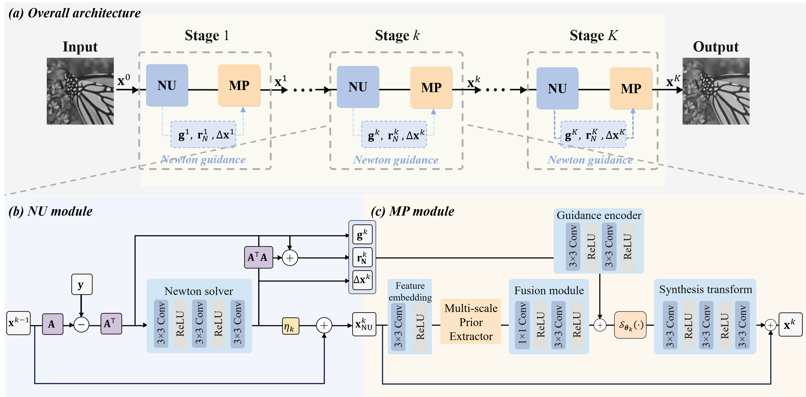

# DNU-Net

The code in this toolbox implements "Newton Deep Unfolding for Compressed Sensing" by <i>C. He, X. Xiu</i>.

### Demo
run test_ndu_net.py for reproduction.

### Citation
Please give credits to this paper if this code is useful and helpful for your research.
